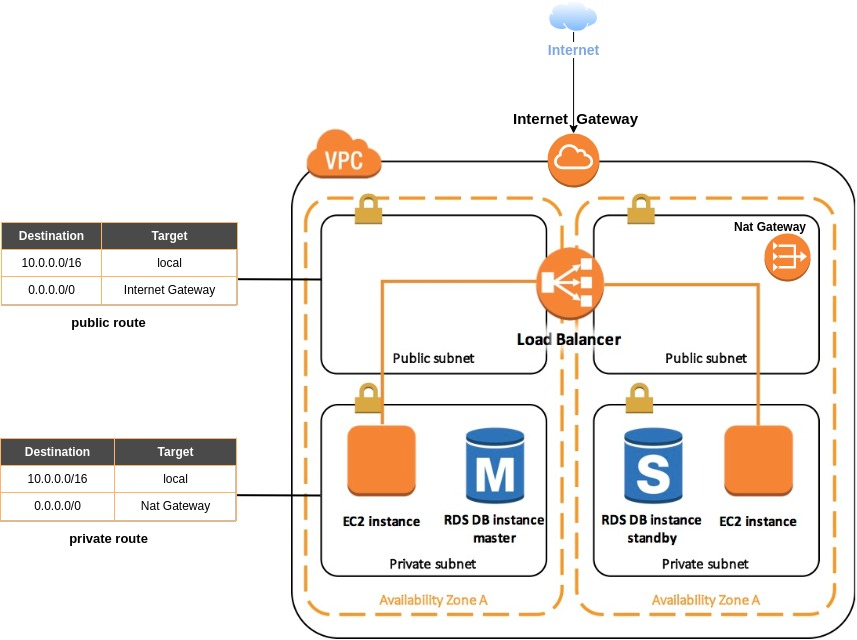
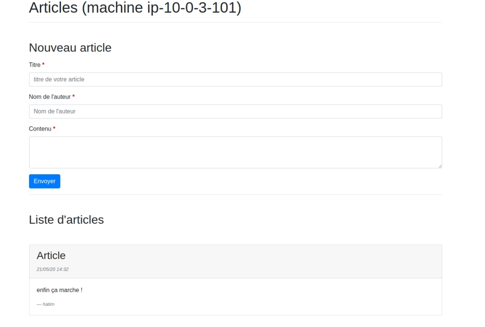

# terraform-aws-ha-web-app

## Description

Builds a highly available AWS infrastructure from Terraform for a php web application communicating with a database.



More informations [here](https://devopssec.fr/article/construire-infrastructure-aws-hautement-disponible-terraform)

## Modules

| name                    |  usage |
|-------------------------|--------|
| `vpc`                   | Creates VPC  with two public subnets for your ELB and two private subnets for your EC2 instances and your RDS service on different AZs| 
| `alb_asg`               | Creates an Auto Scaling group with ELB of type "application" |
| `cloudwatch_cpu_alarms` | Creates a cloudwatch alarms depending on the CPU usage and triggering ASG operations |    
| `s3`                    | Creates an S3 bucket on which the sources of your application will be put |
| `ec2_role_allow_s3`     | Creates an instance profile using an iam role authorizing access to S3 from your EC2 instances |
| `rds`                   | Creates a mariadb relational database used for our EC2 web instances | 

## How it works 

To use this project, you must first indicate the root password of our database. In my case, I chose to define it in a file called `terraform.tfvars` (this file name is automatically considered by Terraform during the execution of your configuration). Example :

```tfvars
db_password = "your-password"
```

Second, you must then create your ssh key pair in the `keys` folder. In my case, I use the `ssh-keygen` command as follows :

```shell
ssh-keygen -t rsa

Generating public/private rsa key pair.
Enter file in which to save the key (/home/hatim/.ssh/id_rsa): ./keys/terraform
Enter passphrase (empty for no passphrase): 
Enter same passphrase again: 
```

Then add the path of your public key in your root module in the `path_to_public_key` parameter of the `my_alb_asg module`. In my case it will be :

```hcl
module "my_alb_asg" {
    ...
    ...
    path_to_public_key   = "/home/hatim/Documents/tmp/terraform/sources/keys/terraform.pub"
    ...
    ...
}
```

You can then launch your configuration with the following command

```shell
terraform init && terraform apply
```

Result :

```
...
...

Outputs:

alb_dns_name = [DNS OF YOUR ELB] 
```

Finally open your browser and test your application from the dns name of your ELB :


